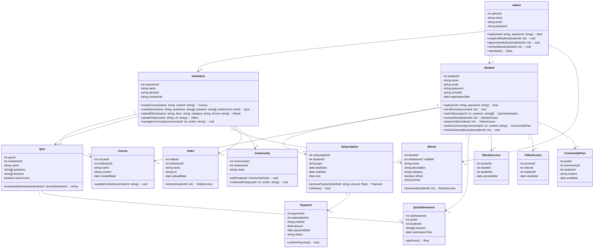
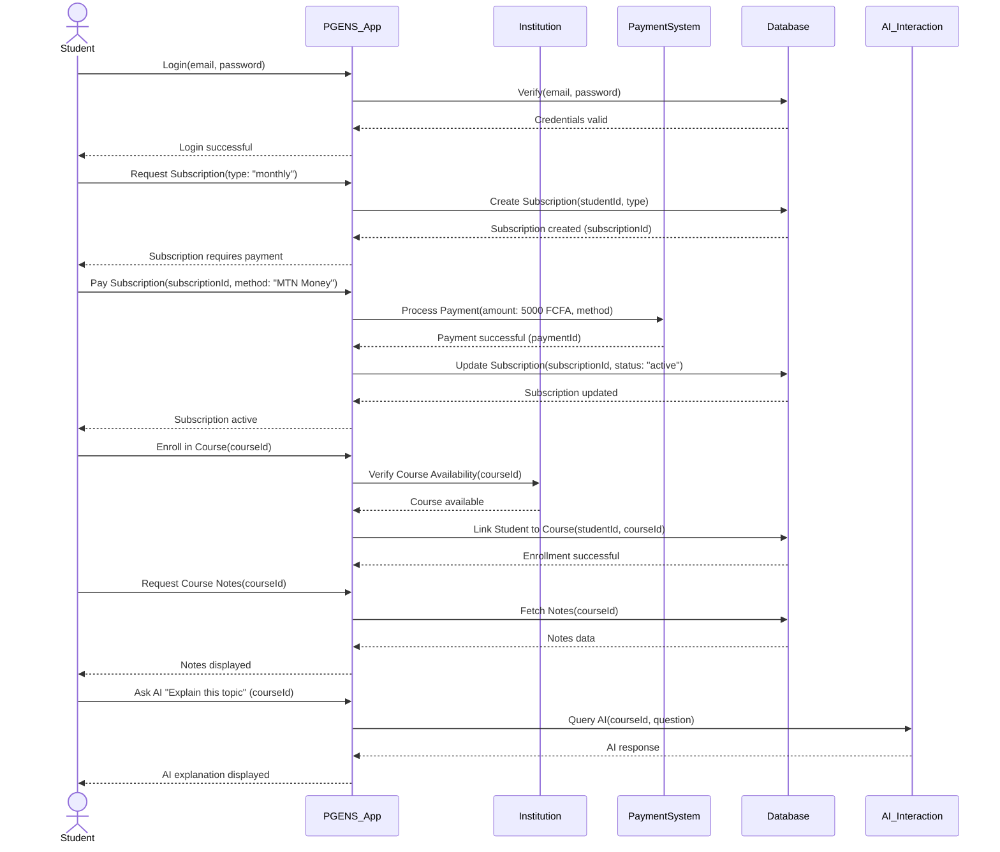

# PGENS Mobile App System Design Documentation

This document outlines the system design for the **PGENS Mobile App**, a learning platform aimed at providing students and learners with structured educational resources globally. The design is based on the specifications provided in the project documents, detailing the app’s mission, features, and technical requirements. Below are the UML diagrams (Entity-Relationship Diagram, Class Diagram, Sequence Diagram, and Use Case Diagrams) created using Mermaid syntax, along with explanations for each.

The current date is **April 10, 2025**, and all designs reflect the app’s planned functionalities as of this date.

---

## 1. Entity-Relationship Diagram (ERD)

The ERD models the data structure and relationships between entities in the PGENS app, ensuring data integrity and support for features like subscriptions, content management, and community interaction.

```mermaid
erDiagram
    STUDENT ||--o{ SUBSCRIPTION : subscribes_to
    STUDENT ||--o{ COURSE : enrolls_in
    STUDENT ||--o{ QUIZ_SUBMISSION : submits
    STUDENT ||--o{ EBOOK_ACCESS : accesses
    STUDENT ||--o{ COMMUNITY_POST : posts_in
    STUDENT ||--o{ VIDEO_ACCESS : views
    INSTITUTION ||--o{ COURSE : creates
    INSTITUTION ||--o{ QUIZ : creates
    INSTITUTION ||--o{ EBOOK : uploads
    INSTITUTION ||--o{ VIDEO : uploads
    INSTITUTION ||--o{ COMMUNITY : manages
    ADMIN ||--o{ INSTITUTION : oversees
    ADMIN ||--o{ STUDENT : suspends
    ADMIN ||--o{ EBOOK : approves
    SUBSCRIPTION ||--o{ PAYMENT : triggers
    QUIZ ||--o{ QUIZ_SUBMISSION : has

    STUDENT {
        int student_id PK "Unique identifier"
        string name "Student's full name"
        string email "Login credential"
        string password "Hashed password"
        string school_id FK "Links to Institution"
        date registration_date "Signup date"
    }
    INSTITUTION {
        int institution_id PK "Unique identifier"
        string name "School name"
        string admin_id FK "Links to Admin"
        string contact_info "Email/phone"
    }
    ADMIN {
        int admin_id PK "Unique identifier"
        string name "Admin's name"
        string email "Login credential"
        string password "Hashed password"
    }
    SUBSCRIPTION {
        int subscription_id PK "Unique identifier"
        int student_id FK "Links to Student"
        string type "Monthly/Yearly"
        date start_date "Subscription start"
        date end_date "Subscription end"
        float cost "Based on plan"
    }
    PAYMENT {
        int payment_id PK "Unique identifier"
        int subscription_id FK "Links to Subscription"
        string method "MTN/Orange Money"
        float amount "Payment amount"
        date payment_date "Date of transaction"
        string status "Pending/Completed"
    }
    COURSE {
        int course_id PK "Unique identifier"
        int institution_id FK "Links to Institution"
        string name "Course title"
        string content "Step-by-step notes"
        date created_date "Upload date"
    }
    QUIZ {
        int quiz_id PK "Unique identifier"
        int institution_id FK "Links to Institution"
        string name "Quiz title"
        string questions "JSON array of Qs"
        string answers "JSON array of As"
        boolean auto_correct "MCQs only"
    }
    QUIZ_SUBMISSION {
        int submission_id PK "Unique identifier"
        int quiz_id FK "Links to Quiz"
        int student_id FK "Links to Student"
        string answers "Student responses"
        date submission_time "Submission timestamp"
    }
    EBOOK {
        int ebook_id PK "Unique identifier"
        int institution_id FK "Optional, null for PGENS"
        string name "Ebook title"
        string description "Short summary"
        string category "Subject/topic"
        boolean is_paid "Free or paid"
        string format "PDF/DOCX"
    }
    EBOOK_ACCESS {
        int access_id PK "Unique identifier"
        int ebook_id FK "Links to Ebook"
        int student_id FK "Links to Student"
        date access_date "Download date"
    }
    VIDEO {
        int video_id PK "Unique identifier"
        int institution_id FK "Links to Institution"
        string name "Video title"
        string url "Streaming URL"
        date upload_date "Upload timestamp"
    }
    VIDEO_ACCESS {
        int access_id PK "Unique identifier"
        int video_id FK "Links to Video"
        int student_id FK "Links to Student"
        date view_date "View timestamp"
    }
    COMMUNITY {
        int community_id PK "Unique identifier"
        int institution_id FK "Links to Institution"
        string name "Forum name"
    }
    COMMUNITY_POST {
        int post_id PK "Unique identifier"
        int community_id FK "Links to Community"
        int student_id FK "Links to Student"
        string content "Text/Images"
        date post_date "Post timestamp"
    }
```

### Explanation
- **Entities**: Core entities include `STUDENT`, `INSTITUTION`, and `ADMIN`, with supporting entities like `SUBSCRIPTION`, `PAYMENT`, `COURSE`, `QUIZ`, `EBOOK`, `VIDEO`, and `COMMUNITY`.
- **Relationships**: Reflects the app’s functionality, such as students enrolling in courses, submitting quizzes, and accessing eBooks/videos, while institutions manage content and communities.
- **Attributes**: Detailed fields (e.g., `type` in `SUBSCRIPTION` as "Monthly/Yearly", `method` in `PAYMENT` as "MTN/Orange Money") align with the revenue model and data model from the specs.
- **Purpose**: Ensures data security (e.g., intellectual property protection) and scalability as per the "Secured and scalable infrastructure" requirement.

---

## 2. Class Diagram

The Class Diagram defines the object-oriented structure, including attributes and methods for each class.

### Explanation
- **Classes**: Represent the app’s core entities with detailed attributes (e.g., `isPaid` in `Ebook`) and methods (e.g., `evaluateSubmission()` in `Quiz`).
- **Relationships**: Show cardinality (e.g., one `Student` can have multiple `QuizSubmission`s) and dependencies (e.g., `Subscription` triggers `Payment`).
- **Methods**: Reflect functionalities like quiz auto-correction (`Quiz.evaluateSubmission()`), content creation (`Institution.createCourse()`), and admin controls (`Admin.suspendStudent()`).
- **Purpose**: Provides a blueprint for the app’s object-oriented implementation using Flutter/Laravel, as specified in the technical requirements.

---

## 3. Sequence Diagram

The Sequence Diagram illustrates the interaction for a student subscribing, paying, and accessing a course.

### Explanation
- **Flow**: Shows a student logging in, subscribing (monthly plan), paying via MTN Money, enrolling in a course, accessing notes, and using AI interaction.
- **Components**: Involves the app (`PGENS_App`), database (`Database`), payment system (`PaymentSystem`), institution (`Institution`), and AI (`AI_Interaction`).
- **Details**: Incorporates the payment model (MTN/Orange Money), course enrollment, and AI search feature from the specs.
- **Purpose**: Demonstrates the app’s workflow, ensuring usability and responsiveness as per the testing and quality requirements.

---

## 4. Use Case Diagrams with Sub-Use Cases

### 4.1 Student Use Case Diagram

```mermaid
graph TD
    A[Student] --> B(Login)
    A --> C(Subscribe to Plan)
    A --> D(Make Payment)
    A --> E(Enroll in Course)
    A --> F(Submit Quiz)
    A --> G(Download Ebook)
    A --> H(Stream Video)
    A --> I(Post in Community)
    A --> J(Ask AI Question)

    B --> Y[System: PGENS App]
    C --> Y
    D --> Y
    E --> Y
    F --> Y
    G --> Y
    H --> Y
    I --> Y
    J --> Y

    subgraph Sub-Use Cases for Subscribe to Plan
        C --> C1(Choose Subscription Type)
        C --> C2(View Subscription Cost)
        C --> C3(Confirm Subscription)
    end

    subgraph Sub-Use Cases for Make Payment
        D --> D1(Select Payment Method)
        D --> D2(Enter Payment Details)
        D --> D3(Confirm Payment)
        D --> D4(View Payment Status)
    end

    subgraph Sub-Use Cases for Enroll in Course
        E --> E1(Browse Available Courses)
        E --> E2(Select Course)
        E --> E3(Confirm Enrollment)
    end

    subgraph Sub-Use Cases for Submit Quiz
        F --> F1(View Quiz Details)
        F --> F2(Answer MCQs)
        F --> F3(Answer Essay Questions)
        F --> F4(Submit Answers)
        F --> F5(View Auto-Corrected Results)
    end

    subgraph Sub-Use Cases for Download Ebook
        G --> G1(Browse Ebook Catalog)
        G --> G2(Select Ebook)
        G --> G3(Check Access Rights)
        G --> G4(Download Ebook)
    end

    subgraph Sub-Use Cases for Stream Video
        H --> H1(Browse Video Library)
        H --> H2(Select Video)
        H --> H3(Stream Video)
        H --> H4(Save Video Progress)
    end

    subgraph Sub-Use Cases for Post in Community
        I --> I1(Join Community Forum)
        I --> I2(Create Post)
        I --> I3(View Community Posts)
        I --> I4(Reply to Post)
    end

    subgraph Sub-Use Cases for Ask AI Question
        J --> J1(Input Question)
        J --> J2(Select Context)
        J --> J3(Receive AI Response)
    end
```

#### Explanation
- **Main Use Cases**: Cover student interactions like subscribing, paying, enrolling, submitting quizzes, downloading eBooks, streaming videos, posting in communities, and using AI.
- **Sub-Use Cases**: Break down each action into steps (e.g., `Make Payment` includes selecting MTN/Orange Money and confirming payment).
- **Purpose**: Ensures students (Category A audience) can access educational content efficiently, aligning with the app’s mission of quality education and affordability.

---

### 4.2 Institution Use Case Diagram

```mermaid
graph TD
    K[Institution] --> L(Login)
    K --> M(Create Course)
    K --> N(Create Quiz)
    K --> O(Upload Ebook)
    K --> P(Upload Video)
    K --> Q(Moderate Community)

    L --> Y[System: PGENS App]
    M --> Y
    N --> Y
    O --> Y
    P --> Y
    Q --> Y

    subgraph Sub-Use Cases for Create Course
        M --> M1(Define Course Name)
        M --> M2(Add Step-by-Step Content)
        M --> M3(Save Course)
        M --> M4(Update Course Content)
    end

    subgraph Sub-Use Cases for Create Quiz
        N --> N1(Define Quiz Name)
        N --> N2(Add MCQ Questions)
        N --> N3(Add Essay Questions)
        N --> N4(Set Correct Answers)
        N --> N5(Publish Quiz)
    end

    subgraph Sub-Use Cases for Upload Ebook
        O --> O1(Enter Ebook Details)
        O --> O2(Upload File)
        O --> O3(Set Access)
        O --> O4(Publish Ebook)
    end

    subgraph Sub-Use Cases for Upload Video
        P --> P1(Enter Video Details)
        P --> P2(Upload Video URL)
        P --> P3(Publish Video)
    end

    subgraph Sub-Use Cases for Moderate Community
        Q --> Q1(View Community Posts)
        Q --> Q2(Block Inappropriate Content)
        Q --> Q3(Delete Post)
        Q --> Q4(Respond to Post)
    end
```

#### Explanation
- **Main Use Cases**: Reflect institution responsibilities (Category B audience) like creating courses, quizzes, uploading eBooks/videos, and moderating communities.
- **Sub-Use Cases**: Detail content creation steps (e.g., `Create Quiz` includes setting correct answers for MCQs) and community moderation actions.
- **Purpose**: Enables institutions to manage and deliver content to students, supporting the app’s goal of educational equality.

---

### 4.3 Admin Use Case Diagram

```mermaid
graph TD
    R[Admin] --> S(Login)
    R --> T(Manage Institution)
    R --> U(Suspend Student)
    R --> V(Approve Ebook)
    R --> W(View Statistics)
    R --> X(Update App Settings)

    S --> Y[System: PGENS App]
    T --> Y
    U --> Y
    V --> Y
    W --> Y
    X --> Y

    subgraph Sub-Use Cases for Manage Institution
        T --> T1(View Institution List)
        T --> T2(Approve Institution Registration)
        T --> T3(Update Institution Details)
        T --> T4(Suspend Institution)
    end

    subgraph Sub-Use Cases for Suspend Student
        U --> U1(View Student List)
        U --> U2(Select Student)
        U --> U3(Suspend Account)
        U --> U4(Notify Student)
    end

    subgraph Sub-Use Cases for Approve Ebook
        V --> V1(View Uploaded Ebooks)
        V --> V2(Check Ebook Content)
        V --> V3(Approve Ebook)
        V --> V4(Remove Ebook)
    end

    subgraph Sub-Use Cases for View Statistics
        W --> W1(View Number of Students)
        W --> W2(View Number of Institutions)
        W --> W3(View Payment Records)
        W --> W4(View Course/Ebook Usage)
    end

    subgraph Sub-Use Cases for Update App Settings
        X --> X1(Modify App Configuration)
        X --> X2(Update Security Settings)
        X --> X3(Save Changes)
    end
```

#### Explanation
- **Main Use Cases**: Cover admin tasks like managing institutions, suspending students, approving eBooks, viewing stats, and updating settings.
- **Sub-Use Cases**: Break down admin actions (e.g., `View Statistics` includes specific metrics like payment records).
- **Purpose**: Provides oversight and control, aligning with the admin dashboard requirements and security testing (e.g., two-factor authentication).

---

## Additional Notes
- **Rendering**: These diagrams can be visualized in GitHub (which supports Mermaid natively) or tools like [Mermaid Live Editor](https://mermaid.live/).
- **Source**: Derived from the PGENS App project documents, including features (e.g., AI integration, payment model), technical requirements (e.g., Flutter/Laravel), and testing goals (e.g., usability, security).
- **Scalability**: The designs support the app’s goal of handling large user bases, with a projected completion date of **July 29, 2025**, per the planning section.

This documentation serves as a comprehensive guide for developers, aligning with the app’s mission to provide quality education globally.

