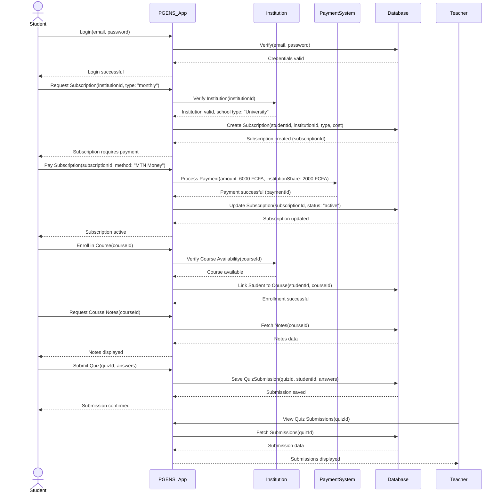
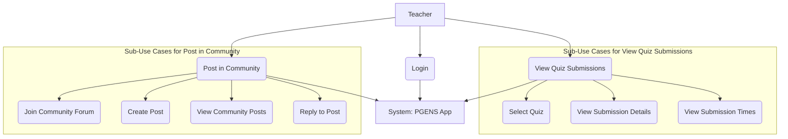

# PGENS Mobile App System Design Documentation

The current date is **April 30, 2025**, and the designs align with the app’s updated functionalities and projected completion by **July 29, 2025**.

---

## 1. Changes from Previous Specifications

The *SPECIFICATION BOOKLET FOR PGENS MOBILE APP* introduces the following changes compared to earlier documents:

1. **Functional Requirements**:
   - **Courses**: Now explicitly include step-by-step content.
   - **Quizzes**: Support MCQs and essay questions, with images, auto-correction for MCQs only, and teacher visibility of submissions.
   - **eBooks**: Include price attribute, institution-specific access, and a new subscription model where students subscribe to schools, with institutions earning a percentage. Subscription fees vary by school type (secondary school vs. university).
   - **Community**: Includes teachers, supports images/messages, and has a moderation system.
   - **Videos**: Centralized storage, streaming, and download capability.
   - **Dashboards**: Student dashboard shows payments; admin dashboard manages quizzes and detailed account actions (view/update/delete/suspend).
   - **Removed Features**: Document editing and AI interaction/search not mentioned.

2. **Revenue Model**:
   - Students subscribe to institutions, with schools receiving a percentage of fees.
   - Subscription fees differ by school type.
   - Institutions access the platform for free.

3. **Technical Requirements**:
   - 24/7 availability (except maintenance).
   - API hosting with unlimited browsing (e.g., CodecHosting/AWS).
   - Non-disruptive, verifiable data backups.

4. **Graphic Charter**: Uses PGENS logo and colors.
5. **Deliverables**: Budget section removed (previously 800,000 FCFA).
6. **Testing**: Detailed testing requirements removed, with implicit testing via availability and backup verification.

These changes are reflected in the updated UML diagrams below.

---

## 2. Entity-Relationship Diagram (ERD)

The ERD models the updated data structure, incorporating school types, subscription relationships, and quiz submission visibility.

```mermaid
erDiagram
    STUDENT ||--o{ SUBSCRIPTION : subscribes_to
    STUDENT ||--o{ COURSE : enrolls_in
    STUDENT ||--o{ QUIZ_SUBMISSION : submits
    STUDENT ||--o{ EBOOK_ACCESS : accesses
    STUDENT ||--o{ COMMUNITY_POST : posts_in
    STUDENT ||--o{ VIDEO_ACCESS : views
    INSTITUTION ||--o{ COURSE : creates
    INSTITUTION ||--o{ QUIZ : creates
    INSTITUTION ||--o{ EBOOK : uploads
    INSTITUTION ||--o{ VIDEO : uploads
    INSTITUTION ||--o{ COMMUNITY : manages
    ADMIN ||--o{ INSTITUTION : oversees
    ADMIN ||--o{ STUDENT : suspends
    ADMIN ||--o{ EBOOK : approves
    SUBSCRIPTION ||--o{ PAYMENT : triggers
    QUIZ ||--o{ QUIZ_SUBMISSION : has
    TEACHER ||--o{ QUIZ_SUBMISSION : views
    INSTITUTION ||--o{ SCHOOL_TYPE : has

    STUDENT {
        int student_id PK "Unique identifier"
        string name "Student's full name"
        string email "Login credential"
        string password "Hashed password"
        string institution_id FK "Links to Institution"
        date registration_date "Signup date"
    }
    INSTITUTION {
        int institution_id PK "Unique identifier"
        string name "School name"
        string school_type_id FK "Links to School Type"
        string admin_id FK "Links to Admin"
        string contact_info "Email/phone"
    }
    SCHOOL_TYPE {
        int school_type_id PK "Unique identifier"
        string type "Secondary/University"
        float subscription_fee "Varies by type"
    }
    TEACHER {
        int teacher_id PK "Unique identifier"
        string name "Teacher's name"
        string email "Login credential"
        string password "Hashed password"
        string institution_id FK "Links to Institution"
    }
    ADMIN {
        int admin_id PK "Unique identifier"
        string name "Admin's name"
        string email "Login credential"
        string password "Hashed password"
    }
    SUBSCRIPTION {
        int subscription_id PK "Unique identifier"
        int student_id FK "Links to Student"
        int institution_id FK "Links to Institution"
        string type "Monthly/Yearly"
        date start_date "Subscription start"
        date end_date "Subscription end"
        float cost "Based on school type"
    }
    PAYMENT {
        int payment_id PK "Unique identifier"
        int subscription_id FK "Links to Subscription"
        string method "MTN/Orange Money"
        float amount "Payment amount"
        float institution_share "Percentage to school"
        date payment_date "Date of transaction"
        string status "Pending/Completed"
    }
    COURSE {
        int course_id PK "Unique identifier"
        int institution_id FK "Links to Institution"
        string name "Course title"
        string content "Step-by-step notes"
        date created_date "Upload date"
    }
    QUIZ {
        int quiz_id PK "Unique identifier"
        int institution_id FK "Links to Institution"
        string name "Quiz title"
        string questions "JSON array of Qs"
        string answers "JSON array of As"
        boolean auto_correct "MCQs only"
        boolean has_images "Supports images"
    }
    QUIZ_SUBMISSION {
        int submission_id PK "Unique identifier"
        int quiz_id FK "Links to Quiz"
        int student_id FK "Links to Student"
        string answers "Student responses"
        date submission_time "Submission timestamp"
    }
    EBOOK {
        int ebook_id PK "Unique identifier"
        int institution_id FK "Optional, null for PGENS"
        string name "Ebook title"
        string description "Short summary"
        string category "Subject/topic"
        boolean is_paid "Free or paid"
        float price "If paid"
        string format "PDF/DOCX"
    }
    EBOOK_ACCESS {
        int access_id PK "Unique identifier"
        int ebook_id FK "Links to Ebook"
        int student_id FK "Links to Student"
        date access_date "Download date"
    }
    VIDEO {
        int video_id PK "Unique identifier"
        int institution_id FK "Links to Institution"
        string name "Video title"
        string url "Streaming URL"
        date upload_date "Upload timestamp"
    }
    VIDEO_ACCESS {
        int access_id PK "Unique identifier"
        int video_id FK "Links to Video"
        int student_id FK "Links to Student"
        date view_date "View timestamp"
    }
    COMMUNITY {
        int community_id PK "Unique identifier"
        int institution_id FK "Links to Institution"
        string name "Forum name"
    }
    COMMUNITY_POST {
        int post_id PK "Unique identifier"
        int community_id FK "Links to Community"
        int student_id FK "Links to Student"
        int teacher_id FK "Optional, for teachers"
        string content "Text/Images"
        date post_date "Post timestamp"
    }
```

### Explanation
- **Updates**:
  - Added `SCHOOL_TYPE` entity to support varying subscription fees by school type (secondary school vs. university).
  - Added `TEACHER` entity to reflect teacher involvement in community forums and quiz submission visibility.
  - Modified `SUBSCRIPTION` to include `institution_id` and `cost` based on school type.
  - Added `institution_share` to `PAYMENT` for revenue sharing.
  - Updated `QUIZ` with `has_images` attribute.
  - Modified `COMMUNITY_POST` to include `teacher_id` for teacher participation.
- **Purpose**: Ensures data model supports new subscription model, teacher interactions, and quiz enhancements.

---

## 3. Class Diagram

The Class Diagram reflects the updated object-oriented structure.

```mermaid
classDiagram
    class Student {
        -int studentId
        -string name
        -string email
        -string password
        -string institutionId
        -date registrationDate
        +login(email: string, password: string) : bool
        +subscribeToInstitution(institutionId: int, type: string) : Subscription
        +enrollCourse(courseId: int) : void
        +submitQuiz(quizId: int, answers: string[]) : QuizSubmission
        +accessEbook(ebookId: int) : EbookAccess
        +streamVideo(videoId: int) : VideoAccess
        +postInCommunity(communityId: int, content: string) : CommunityPost
    }
    class Institution {
        -int institutionId
        -string name
        -string schoolTypeId
        -string adminId
        -string contactInfo
        +createCourse(name: string, content: string) : Course
        +createQuiz(name: string, questions: string[], answers: string[], autoCorrect: bool, hasImages: bool) : Quiz
        +uploadEbook(name: string, desc: string, category: string, format: string, price: float) : Ebook
        +uploadVideo(name: string, url: string) : Video
        +manageCommunity(communityId: int, action: string) : void
    }
    class SchoolType {
        -int schoolTypeId
        -string type
        -float subscriptionFee
    }
    class Teacher {
        -int teacherId
        -string name
        -string email
        -string password
        -string institutionId
        +login(email: string, password: string) : bool
        +viewQuizSubmissions(quizId: int) : QuizSubmission[]
        +postInCommunity(communityId: int, content: string) : CommunityPost
    }
    class Admin {
        -int adminId
        -string name
        -string email
        -string password
        +login(email: string, password: string) : bool
        +suspendStudent(studentId: int) : void
        +suspendInstitution(institutionId: int) : void
        +approveEbook(ebookId: int) : void
        +viewStats() : Stats
        +manageQuizzes(quizId: int, action: string) : void
    }
    class Subscription {
        -int subscriptionId
        -int studentId
        -int institutionId
        -string type
        -date startDate
        -date endDate
        -float cost
        +processPayment(method: string, amount: float) : Payment
        +isActive() : bool
    }
    class Payment {
        -int paymentId
        -int subscriptionId
        -string method
        -float amount
        -float institutionShare
        -date paymentDate
        -string status
        +confirmPayment() : bool
    }
    class Course {
        -int courseId
        -int institutionId
        -string name
        -string content
        -date createdDate
        +updateContent(newContent: string) : void
    }
    class Quiz {
        -int quizId
        -int institutionId
        -string name
        -string[] questions
        -string[] answers
        -boolean autoCorrect
        -boolean hasImages
        +evaluateSubmission(submission: QuizSubmission) : string
    }
    class QuizSubmission {
        -int submissionId
        -int quizId
        -int studentId
        -string[] answers
        -date submissionTime
        +getScore() : float
    }
    class Ebook {
        -int ebookId
        -int institutionId "nullable"
        -string name
        -string description
        -string category
        -boolean isPaid
        -float price
        -string format
        +download(studentId: int) : EbookAccess
    }
    class EbookAccess {
        -int accessId
        -int ebookId
        -int studentId
        -date accessDate
    }
    class Video {
        -int videoId
        -int institutionId
        -string name
        -string url
        -date uploadDate
        +stream(studentId: int) : VideoAccess
        +download(studentId: int) : VideoAccess
    }
    class VideoAccess {
        -int accessId
        -int videoId
        -int studentId
        -date viewDate
    }
    class Community {
        -int communityId
        -int institutionId
        -string name
        +addPost(post: CommunityPost) : void
        +moderatePost(postId: int, action: string) : void
    }
    class CommunityPost {
        -int postId
        -int communityId
        -int studentId "nullable"
        -int teacherId "nullable"
        -string content
        -date postDate
    }

    Student "1" --> "0..*" Subscription
    Student "1" --> "0..*" Course
    Student "1" --> "0..*" QuizSubmission
    Student "1" --> "0..*" EbookAccess
    Student "1" --> "0..*" VideoAccess
    Student "1" --> "0..*" CommunityPost
    Institution "1" --> "0..*" Course
    Institution "1" --> "0..*" Quiz
    Institution "1" --> "0..*" Ebook
    Institution "1" --> "0..*" Video
    Institution "1" --> "0..*" Community
    Institution "1" --> "1" SchoolType
    Teacher "1" --> "0..*" QuizSubmission
    Teacher "1" --> "0..*" CommunityPost
    Admin "1" --> "0..*" Institution
    Admin "1" --> "0..*" Student
    Admin "1" --> "0..*" Ebook
    Admin "1" --> "0..*" Quiz
    Subscription "1" --> "0..*" Payment
    Quiz "1" --> "0..*" QuizSubmission
```

### Explanation
- **Updates**:
  - Added `SchoolType` class for subscription fee differentiation.
  - Added `Teacher` class with methods for quiz submission viewing and community posting.
  - Updated `Subscription` with `institutionId` and `cost`.
  - Added `institutionShare` to `Payment`.
  - Updated `Quiz` with `hasImages`.
  - Added `download()` to `Video` for download capability.
  - Updated `CommunityPost` to support `teacherId`.
  - Added `manageQuizzes()` to `Admin`.
- **Purpose**: Reflects new teacher role, subscription model, and enhanced quiz/video features.

---

## 4. Sequence Diagram

The Sequence Diagram illustrates a student subscribing to an institution, paying, and accessing a course.

### Explanation
- **Updates**:
  - Subscription now involves `institutionId` and school type-specific cost (e.g., 6000 FCFA for a university).
  - Payment includes `institutionShare` for revenue sharing.
  - Added teacher interaction for viewing quiz submissions.
- **Purpose**: Reflects the new subscription model and teacher functionality.

---

## 5. Use Case Diagrams with Sub-Use Cases

### 5.1 Student Use Case Diagram

```mermaid
graph TD
    A[Student] --> B(Login)
    A --> C(Subscribe to Institution)
    A --> D(Make Payment)
    A --> E(Enroll in Course)
    A --> F(Submit Quiz)
    A --> G(Download Ebook)
    A --> H(Stream Video)
    A --> I(Download Video)
    A --> J(Post in Community)
    A --> K(View Dashboard)

    B --> Y[System: PGENS App]
    C --> Y
    D --> Y
    E --> Y
    F --> Y
    G --> Y
    H --> Y
    I --> Y
    J --> Y
    K --> Y

    subgraph Sub-Use Cases for Subscribe to Institution
        C --> C1(Choose Institution)
        C --> C2(Select Subscription Type)
        C --> C3(View Subscription Cost)
        C --> C4(Confirm Subscription)
    end

    subgraph Sub-Use Cases for Make Payment
        D --> D1(Select Payment Method)
        D --> D2(Enter Payment Details)
        D --> D3(Confirm Payment)
        D --> D4(View Payment Status)
    end

    subgraph Sub-Use Cases for Enroll in Course
        E --> E1(Browse Available Courses)
        E --> E2(Select Course)
        E --> E3(Confirm Enrollment)
    end

    subgraph Sub-Use Cases for Submit Quiz
        F --> F1(View Quiz Details)
        F --> F2(Answer MCQs)
        F --> F3(Answer Essay Questions)
        F --> F4(Submit Answers)
        F --> F5(View Auto-Corrected Results)
    end

    subgraph Sub-Use Cases for Download Ebook
        G --> G1(Browse Ebook Catalog)
        G --> G2(Select Ebook)
        G --> G3(Check Access Rights)
        G --> G4(Download Ebook)
    end

    subgraph Sub-Use Cases for Stream Video
        H --> H1(Browse Video Library)
        H --> H2(Select Video)
        H --> H3(Stream Video)
        H --> H4(Save Video Progress)
    end

    subgraph Sub-Use Cases for Download Video
        I --> I1(Browse Video Library)
        I --> I2(Select Video)
        I --> I3(Download Video)
    end

    subgraph Sub-Use Cases for Post in Community
        J --> J1(Join Community Forum)
        J --> J2(Create Post)
        J --> J3(View Community Posts)
        J --> J4(Reply to Post)
    end

    subgraph Sub-Use Cases for View Dashboard
        K --> K1(View Purchased Books)
        K --> K2(View Enrolled Courses)
        K --> K3(View Payments)
        K --> K4(View Latest Updates)
    end
```

#### Explanation
- **Updates**:
  - Changed `Subscribe to Plan` to `Subscribe to Institution` to reflect the new model.
  - Added `Download Video` use case.
  - Added `View Dashboard` with payment visibility.
- **Purpose**: Aligns with the institution-based subscription and enhanced dashboard.

---

### 5.2 Institution Use Case Diagram

```mermaid
graph TD
    K[Institution] --> L(Login)
    K --> M(Create Course)
    K --> N(Create Quiz)
    K --> O(Upload Ebook)
    K --> P(Upload Video)
    K --> Q(Moderate Community)

    L --> Y[System: PGENS App]
    M --> Y
    N --> Y
    O --> Y
    P --> Y
    Q --> Y

    subgraph Sub-Use Cases for Create Course
        M --> M1(Define Course Name)
        M --> M2(Add Step-by-Step Content)
        M --> M3(Save Course)
        M --> M4(Update Course Content)
    end

    subgraph Sub-Use Cases for Create Quiz
        M --> N1(Define Quiz Name)
        M --> N2(Add MCQ Questions)
        M --> N3(Add Essay Questions)
        M --> N4(Add Images to Questions)
        M --> N5(Set Correct Answers)
        M --> N6(Publish Quiz)
    end

    subgraph Sub-Use Cases for Upload Ebook
        O --> O1(Enter Ebook Details)
        O --> O2(Upload File)
        O --> O3(Set Access)
        O --> O4(Set Price)
        O --> O5(Publish Ebook)
    end

    subgraph Sub-Use Cases for Upload Video
        P --> P1(Enter Video Details)
        P --> P2(Upload Video URL)
        P --> P3(Publish Video)
    end

    subgraph Sub-Use Cases for Moderate Community
        Q --> Q1(View Community Posts)
        Q --> Q2(Block Inappropriate Content)
        Q --> Q3(Delete Post)
        Q --> Q4(Respond to Post)
    end
```

#### Explanation
- **Updates**:
  - Added `Add Images to Questions` and `Set Price` sub-use cases for quizzes and eBooks, respectively.
- **Purpose**: Reflects quiz image support and eBook pricing.

---

### 5.3 Teacher Use Case Diagram

#### Explanation
- **Updates**: New diagram for `Teacher` role, covering quiz submission viewing and community participation.
- **Purpose**: Supports teacher involvement in quizzes and forums.

---

### 5.4 Admin Use Case Diagram

```mermaid
graph TD
    R[Admin] --> S(Login)
    R --> T(Manage Institution)
    R --> U(Suspend Student)
    R --> V(Approve Ebook)
    R --> W(View Statistics)
    R --> X(Update App Settings)
    R --> Z(Manage Quizzes)

    S --> Y[System: PGENS App]
    T --> Y
    U --> Y
    V --> Y
    W --> Y
    X --> Y
    Z --> Y

    subgraph Sub-Use Cases for Manage Institution
        T --> T1(View Institution List)
        T --> T2(Approve Institution Registration)
        T --> T3(Update Institution Details)
        T --> T4(Suspend Institution)
    end

    subgraph Sub-Use Cases for Suspend Student
        U --> U1(View Student List)
        U --> U2(Select Student)
        U --> U3(Suspend Account)
        U --> U4(Notify Student)
    end

    subgraph Sub-Use Cases for Approve Ebook
        V --> V1(View Uploaded Ebooks)
        V --> V2(Check Ebook Content)
        V --> V3(Approve Ebook)
        V --> V4(Remove Ebook)
    end

    subgraph Sub-Use Cases for View Statistics
        W --> W1(View Number of Students)
        W --> W2(View Number of Institutions)
        W --> W3(View Payment Records)
        W --> W4(View Course/Ebook Usage)
    end

    subgraph Sub-Use Cases for Update App Settings
        X --> X1(Modify App Configuration)
        X --> X2(Update Security Settings)
        X --> X3(Save Changes)
    end

    subgraph Sub-Use Cases for Manage Quizzes
        Z --> Z1(View Uploaded Quizzes)
        Z --> Z2(Update Quiz Details)
        Z --> Z3(Remove Quiz)
    end
```

#### Explanation
- **Updates**: Added `Manage Quizzes` use case.
- **Purpose**: Reflects admin’s new quiz management capability.

---

## Additional Notes
- **Rendering**: Diagrams can be visualized in GitHub or [Mermaid Live Editor](https://mermaid.live/).
- **Source**: Based on the *SPECIFICATION BOOKLET FOR PGENS MOBILE APP*, with changes like the institution subscription model and teacher role incorporated.
- **Scalability**: Designs support 24/7 availability and scalable architecture (Flutter/Laravel).
- **Testing**: Implicit testing via availability and backup verification, with prior user testing (YWCA-Younde, HISMIL University) assumed.

This documentation provides a comprehensive guide for developers, aligning with the app’s mission to deliver quality education globally.

